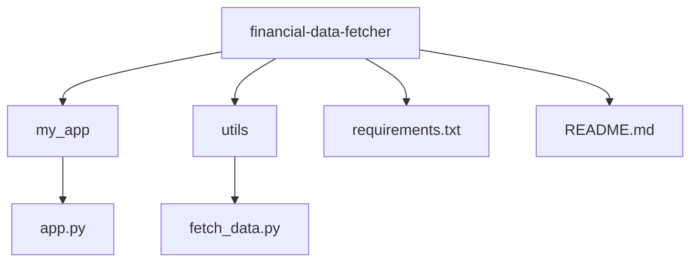

# Financial Data Fetcher Application

This application provides a simple and accurate method to fetch financial data using the API from [site.financialmodelingprep.com](https://site.financialmodelingprep.com). It serves as a preferred alternative to platforms like Yahoo Finance, which can be cluttered with ads, multiple tabs, and other distractions.

## Getting Started

1. Clone the repository.
2. Navigate to the project root directory.
3. Install the required packages using:

    ```
    
    pip3 install -r requirements.txt
    
    ```
    
5. Sign up at [site.financialmodelingprep.com](https://site.financialmodelingprep.com) to obtain the API key.

## Directory Structure


## Contributing

Pull requests are welcome. For major changes, please open an issue first to discuss what you would like to change.

## License

[MIT](https://choosealicense.com/licenses/mit/)

