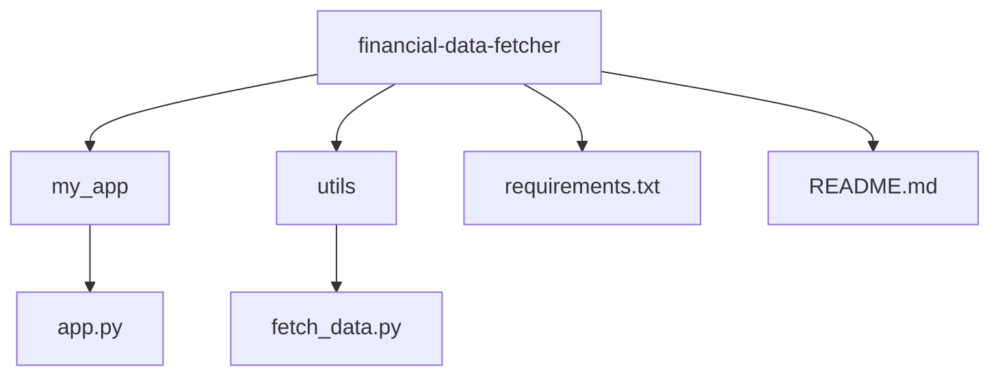

# Financial Data Fetcher Application

This application provides a simple and accurate method to fetch financial data. It uses the API from [site.financialmodelingprep.com](https://site.financialmodelingprep.com). This tool offers an advantage over platforms like Yahoo Finance, which often have ads, multiple tabs, and other distractions.

## Getting Started

### 1. Clone the Repository:
Clone this repository to your local machine to get started.

### 2. Set Up the Virtual Environment:
Navigate to the project root directory and set up a virtual environment. Install the necessary packages using:
    ```
    pip3 install -r requirements.txt
    ```
### 3. Obtain the API Key:
Sign up at [site.financialmodelingprep.com](https://site.financialmodelingprep.com) to obtain your free API key.

### 4. Input the API Key:
Open the `fetch_data.py` file located inside the `utils` folder. Insert your API key on line 8 where indicated.

### 5. Run the Application:
With the API key in place, you can now run the application.

## Directory Structure


## Contributing

If you wish to contribute to this project, please create a pull request. For significant changes, open an issue first to discuss what you'd like to modify.

## License

[MIT](https://choosealicense.com/licenses/mit/)


